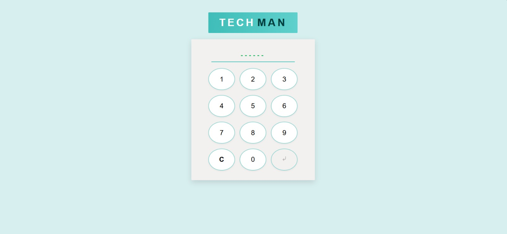
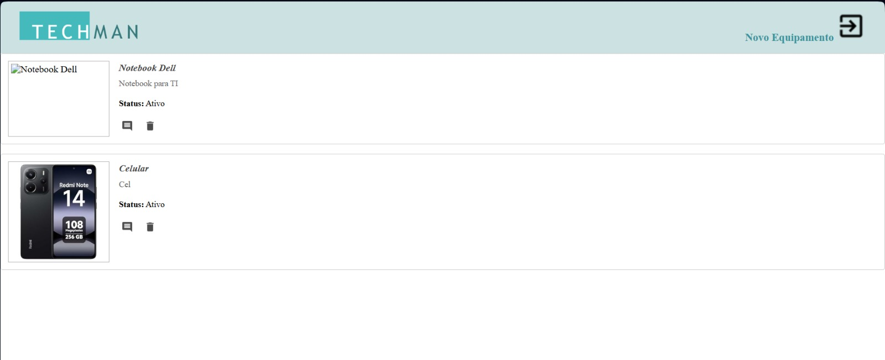

# AvaliacaoPratica-Techman

Este projeto é uma solução completa para controle de equipamentos, usuários, perfis e comentários, desenvolvida como avaliação prática do curso de Programação Orientada a Objetos (PSOF) do SESI/SENAI.

## Estrutura do Projeto

- [`api/`](./api/): Backend 
- [`web/`](./web/): Frontend

## Prints das Telas

### Tela de Login

### Tela de Home

---

## Como iniciar o projeto

Consulte os arquivos específicos para instruções detalhadas:

- [API - Backend](./api/README.md)
- [Web - Frontend](./web/README.md)

---
 ***Feito por Laila Casadei Macêdo***